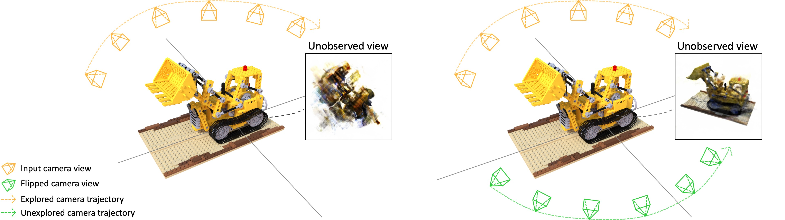

# Just Flip: Flipped Observation Generation and Optimization for Neural Radiance Fields to Cover Unobserved View

### **This is a prototype version and will be updated to a more user-friendly version for future execution.**
<br/>

Implementation of our method. Our data agumentation approach is flippimg observed images, and estimating flipped camera 6DoF poses.
<br/>

## Overview

(Left) the baseline approach where the robot only observes one side of an object while driving. This case does not yield good rendering results in unobserved views that the robot has not explored. (Right) our method generates the flipped observations from the actual observations. The robot exploits both input images and flipped images and estimated camera poses to learn 3D space using NeRF for unexplored regions as well. 

<br/><br/>

## Enviroment setup
Our baseline model is gnerf. So follow the instructions for setting up the environment in the gnerf folder. Our method could be applicable to other models, such as [barf].

[barf]: https://github.com/chenhsuanlin/bundle-adjusting-NeRF


<br/><br/>

## Flipping image
We flipped the image using the flip function in the cv2 module.

 ```
import cv2

img1 = cv2.imread('image.png')
flipped_image = cv2.flip(img1, 1)
cv2.imwrite('flipped_image.png', flipped_image)
 ```

<br/><br/>

## Pose estimation

Ax + By + Cz + D = 0 is symmetric plane equation and X_list, Y_list, Z_list are input camera coordinates.

 ```

 ```


Find the optimal sphere using least squares to pass through the input camera pose.

Symmetrically transforming the input camera pose with respect to the symmetrical plane.

Project the symmetrically transformed points onto the optimized sphere.

Estimate the rotation matrix of a flipped camera pose.


<br/><br/>


## Acknowledgements
This implementation is based on guan-meng's [gnerf].

[gnerf]: https://github.com/quan-meng/gnerf